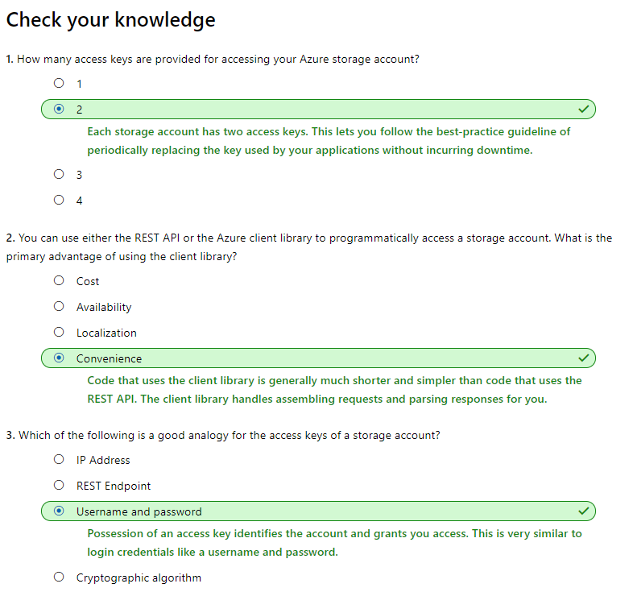

# [Connect an app to Azure Storage](https://docs.microsoft.com/en-au/learn/modules/connect-an-app-to-azure-storage/index)
- [Introduction](https://docs.microsoft.com/en-au/learn/modules/connect-an-app-to-azure-storage/1-introduction)
- [Explore Azure storage services](https://docs.microsoft.com/en-au/learn/modules/connect-an-app-to-azure-storage/2-explore-azure-storage)
  - Azure data services
    - Blobs: A massively scalable object store for text and binary data.
    - Files: Managed file shares for cloud or on-premises deployments.
    - Queues: A messaging store for reliable messaging between application components.
    - Tables: A NoSQL store for schemaless storage of structured data. This service has been replaced by Azure Cosmos DB and will not be discussed here.
  - Blobs
    |Blob type	|Usage	|Description|
    |-----|-----|-----|
    |Block blobs	|**Media files**	|Block blobs are used to hold text or binary files up to ~5 TB (50,000 blocks of 100 MB) in size. The primary use case for block blobs is the storage of files that are read from beginning to end, such as media files or image files for websites. |
    |Page blobs	|**Durable disks for VMS**	|Page blobs are used to hold random-access files up to 8 TB in size. Page blobs are used primarily as the backing storage for the VHDs used to provide durable disks for Azure Virtual Machines (Azure VMs). They are named page blobs because they provide random read/write access to 512-byte pages. |
    |Append blobs	|**Store logging info**	|Append blobs are made up of blocks like block blobs, but they are optimized for append operations. These are frequently used for logging information from one or more sources into the same blob. For example, you might write all of your trace logging to the same append blob for an application running on multiple VMs. A single append blob can be up to 195 GB. |
  - Files
    - Azure Files enables you to set up highly available network file shares that can be accessed by using the standard Server Message Block (SMB) protocol. 
    - This means that multiple VMs can share the same files with both read and write access. You can also read the files using the REST interface or the storage client libraries. 
    - File shares can be used for many common scenarios:
    	- Storing shared configuration files for VMs, tools, or utilities so that everyone is using the same version.
    	- Log files such as diagnostics, metrics, and crash dumps.
    	- Shared data between on-premises applications and Azure VMs to allow migration of apps to the cloud over a period of time.
  - Queues
    - The Azure Queue service is used to store and retrieve messages. 
    - Queue messages can be up to 64 KB in size, and a queue can contain millions of messages. 
    - Queues are generally used to store lists of messages to be processed asynchronously.

- [Exercise - Create a new app to work with Azure storage](https://docs.microsoft.com/en-au/learn/modules/connect-an-app-to-azure-storage/3-exercise-create-your-app)

- [Exercise - Create an Azure storage account](https://docs.microsoft.com/en-au/learn/modules/connect-an-app-to-azure-storage/4-exercise-create-storage-account)
- [Interact with the Azure Storage APIs](https://docs.microsoft.com/en-au/learn/modules/connect-an-app-to-azure-storage/5-interact-with-azure-storage-apis)
- [Exercise - Add the storage client library to your app](https://docs.microsoft.com/en-au/learn/modules/connect-an-app-to-azure-storage/6-exercise-add-the-azure-storage-lib)
- [Connect to your Azure storage account](https://docs.microsoft.com/en-au/learn/modules/connect-an-app-to-azure-storage/7-connect-to-your-azure-storage-account)
  - Connect to your Azure storage account
    - To work with data in a storage account, your app will need two pieces of data:
      - An access key
        - Each storage account has two unique access keys that are used to secure the storage account. If your app needs to connect to multiple storage accounts, then your app will require an access key for each storage account.
      - The REST API endpoint
        - The REST endpoint is a combination of your storage account name, the data type, and a known domain. For example:
            | Data type	| Example endpoint |
            | ---- | ---- |
            | Blobs	| https://[name].blob.core.windows.net/ |
            | Queues| https://[name].queue.core.windows.net/ |
            | Table	| https://[name].table.core.windows.net/ |
            | Files	| https://[name].file.core.windows.net/ |
  - Security
    - Typically, storage account connectivity information is stored within an environment variable, database, or configuration file.
  - Shared access signatures (SAS)
    - Storage accounts offer a separate authentication mechanism called shared access signatures that support expiration and limited permissions for scenarios where you need to grant limited access. You should use this approach when you are allowing other users to read and write data to your storage account. 

- [Exercise - Add Azure Storage configuration to your app](https://docs.microsoft.com/en-au/learn/modules/connect-an-app-to-azure-storage/8-exercise-add-azure-storage-configuration-to-your-app)
- [Initialize the storage account model](https://docs.microsoft.com/en-au/learn/modules/connect-an-app-to-azure-storage/9-initialize-the-storage-account-model)
  - Azure Storage client library object model
    - example of creating a client to use for blob storage:
    ```c#
    using Microsoft.WindowsAzure.Storage;

    CloudStorageAccount storageAccount = CloudStorageAccount.Parse("your-storage-key-connection-string");

    CloudBlobClient blobClient = storageAccount.CreateCloudBlobClient();
    ```
  - As an example, we can use the CloudBlobClient to create a blob container and upload a file to blob storage.
    ```c#
    // Create a local CloudBlobContainer object. No network call.
    string containerName = "myblobcontainer";
    CloudBlobContainer blobContainer = blobClient.GetContainerReference(containerName);

    // This makes an actual service call to the Azure Storage service. 
    // Unless this call fails, the container will have been created.
    await blobContainer.CreateAsync();

    // Create a local object to represent our blob. No network call.
    string blobName = "myphoto";
    CloudBlockBlob blob = blobContainer.GetBlockBlobReference(blobName);

    // This transfers data in the file to the blob on the service.
    string filename = "photo.png";
    await blob.UploadFromFileAsync(fileName);
    ```
- [Exercise - Connect with your Azure Storage configuration](https://docs.microsoft.com/en-au/learn/modules/connect-an-app-to-azure-storage/10-exercise-connect-with-your-azure-storage-configuration)
- [Knowledge check](https://docs.microsoft.com/en-au/learn/modules/connect-an-app-to-azure-storage/11-knowledge-check)
  - 
- [Summary](https://docs.microsoft.com/en-au/learn/modules/connect-an-app-to-azure-storage/12-summary)
  - Additional resources
    - Azure Storage Services REST API Reference
    - Using shared access signatures to provide limited access to a storage account
    - Using Azure Key Vault Storage Account Keys with server apps
    - Source code for the .NET Azure SDKs
    - Azure Storage Client Library for JavaScript