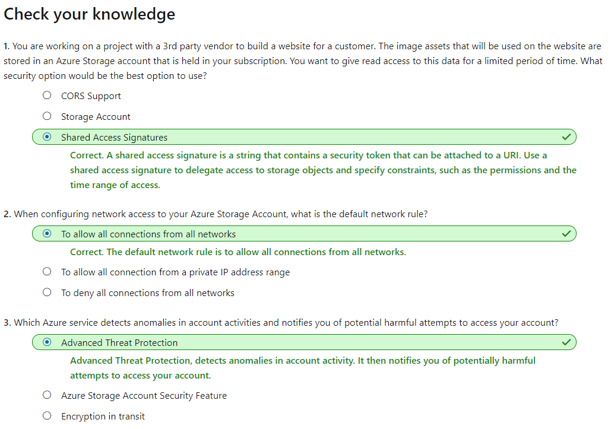

# [Secure your Azure Storage account](https://docs.microsoft.com/en-au/learn/modules/secure-azure-storage-account/index)

```
https://onedrive.live.com/view.aspx?resid=471B297280878A61%21153&id=documents&wd=target%28Pluralsight.one%7C14086A26-95B0-46E7-B98C-1F6B3B36C424%2FStore%20data%20in%20Azure%7CE75FD684-6EB5-4931-841F-F3F5D31B030F%2F%29
onenote:https://d.docs.live.net/471b297280878a61/Documents/Kaiqi%20的笔记本/Pluralsight.one#Store%20data%20in%20Azure&section-id={14086A26-95B0-46E7-B98C-1F6B3B36C424}&page-id={E75FD684-6EB5-4931-841F-F3F5D31B030F}&end
```

- [Introduction](https://docs.microsoft.com/en-au/learn/modules/secure-azure-storage-account/1-introduction)
- [Explore Azure Storage security features](https://docs.microsoft.com/en-au/learn/modules/secure-azure-storage-account/2-storage-security-features)
- Azure Storage accounts provide several high-level security benefits for the data in the cloud:
  - Protect the data at rest
    - All data written to Azure Storage is automatically encrypted by Storage Service Encryption (SSE) with a 256-bit Advanced Encryption Standard (AES) cipher. 
      - It can't be disabled.
    - For virtual machines (VMs), Azure lets you encrypt virtual hard disks (VHDs) by using Azure Disk Encryption. This encryption 
      - uses **BitLocker** for **Windows**
      - uses **dm-crypt** for **Linux**
  - Protect the data in transit
  - Support browser cross-domain access
  - Control who can access data
  - Audit storage access
- [Understand storage account keys](https://docs.microsoft.com/en-au/learn/modules/secure-azure-storage-account/3-storage-account-keys)
  - Storage account keys
    - In Azure Storage accounts, **shared keys** are called storage account keys. Azure creates two of these keys (primary and secondary) for each storage account you create. The keys give access to everything in the account.
  - Protecting shared keys
    - The storage account has only two keys, and they provide full access to the account. Because these keys are powerful, use them only with trusted in-house applications that you control completely.
    - To refresh keys:
      - Change each trusted app to use the secondary key.
      - Refresh the primary key in the Azure portal. Consider this as the new secondary key value.
- [Understand shared access signatures](https://docs.microsoft.com/en-au/learn/modules/secure-azure-storage-account/4-shared-access-signatures)
  - Types of shared access signatures
    - **service-level**: specific resources
    - **account-level** : all resources
- [Control network access to your storage account](https://docs.microsoft.com/en-au/learn/modules/secure-azure-storage-account/5-control-network-access)
  - By default, storage accounts accept connections from clients on any network. 
- [Understand Advanced Threat Protection for Azure Storage](https://docs.microsoft.com/en-au/learn/modules/secure-azure-storage-account/6-advanced-threat-protection)   
  - Advanced Threat Protection, now in public preview, detects anomalies in account activity. It then notifies you of potentially harmful attempts to access your account. You don't have to be a security expert or manage security monitoring systems to take advantage of this layer of threat protection.
  - Currently, Advanced Threat Protection for Azure Storage is available for the Blob service. Security alerts are integrated with Azure Security Center. The alerts are sent by email to subscription admins.
- [Explore Azure Data Lake Storage security features](https://docs.microsoft.com/en-au/learn/modules/secure-azure-storage-account/7-adl-enterprise-security-features)
- [Summary](https://docs.microsoft.com/en-au/learn/modules/secure-azure-storage-account/8-summary)
  - 